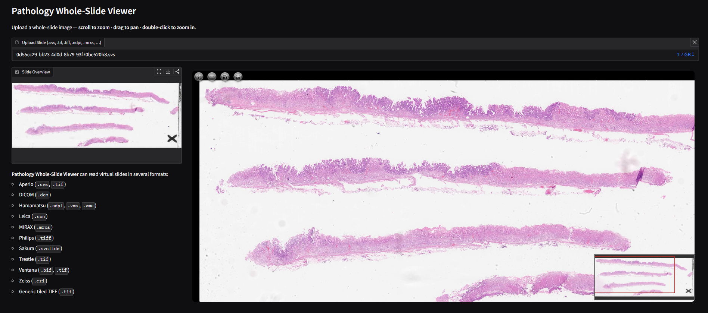
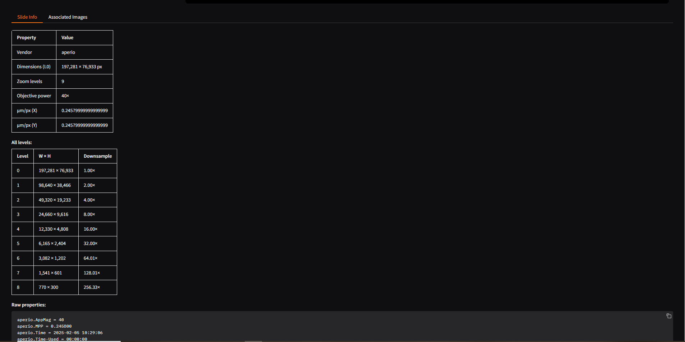

# Pathology Whole-Slide Viewer

A lightweight whole-slide pathology viewer built with Gradio, OpenSlide, and OpenSeadragon. It lets you upload a virtual slide, inspect slide metadata, browse associated images, and pan/zoom the full-resolution slide in the browser.

## Hugging Face Space

Live demo: [Pathology Whole-Slide Viewer on Hugging Face Spaces](https://huggingface.co/spaces/Pial2233/Pathology_Whole-Slide_Viewer)

## Interface





## Features

- Upload and open pathology whole-slide images locally
- View a generated slide thumbnail
- Explore the slide with deep zoom, pan, and scroll zoom
- Inspect OpenSlide metadata and pyramid level information
- Preview associated images such as label and macro images
- Supports common pathology slide formats through OpenSlide

## Tech Stack

- Python
- Gradio
- OpenSlide
- OpenSeadragon

## Supported Formats

This viewer is configured for common OpenSlide-compatible formats, including:

- Aperio: `.svs`, `.tif`
- DICOM: `.dcm`
- Hamamatsu: `.ndpi`, `.vms`, `.vmu`
- Leica: `.scn`
- MIRAX: `.mrxs`
- Philips: `.tiff`
- Sakura: `.svslide`
- Trestle: `.tif`
- Ventana: `.bif`, `.tif`
- Zeiss: `.czi`
- Generic tiled TIFF: `.tif`

Actual support depends on your local OpenSlide runtime and the specific slide file.

## Local Setup

1. Create and activate a virtual environment.
2. Install dependencies:

```bash
pip install -r requirements.txt
```

3. Start the app:

```bash
python app.py
```

4. Open the Gradio URL shown in the terminal.

## How It Works

- `app.py` loads slides with OpenSlide
- FastAPI routes in the same app expose Deep Zoom metadata and tiles
- OpenSeadragon renders the interactive slide viewer inside the Gradio app
- Slide metadata and associated images are displayed alongside the viewer

## Notes

- Large slide files can take time to open.
- On Windows, antivirus or file locking can temporarily block uploaded files from being read.
- Runtime upload capacity depends on available disk and memory in the local environment or hosting platform.

## Project Structure

```text
.
|-- app.py
|-- requirements.txt
|-- README.md
```
